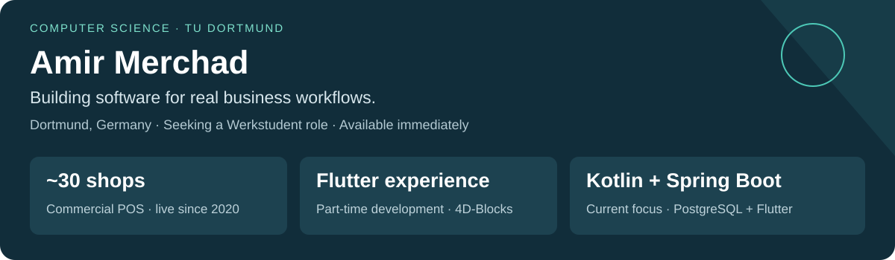

**Computer science student at TU Dortmund, based in Dortmund.** Available immediately for **Werkstudent software development roles** and interested in suitable junior opportunities.

I co-developed and sold **Carto POS** with my father: live since **2020**, now used by **around 30 shops in Lebanon**. I also have professional Flutter experience and am building my Kotlin/Spring Boot skills through an implemented inventory prototype.

[Email](mailto:amirmerchad@gmail.com) · [LinkedIn](https://www.linkedin.com/in/amir-merchad-9ab916320) · [Carto POS screenshots and engineering notes](https://github.com/Amir-Merchad/carto-pos)

## Selected work

| Project | Evidence to explore | Stack / status |
|---|---|---|
| **[Carto POS](https://github.com/Amir-Merchad/carto-pos)** | Commercial retail workflows, demo screenshots, split-database architecture and engineering notes. Co-developed and sold with my father. | MS Access · SQL · VBA — **live classic product; modernization in development** |
| **[Inventory Playground](https://github.com/Amir-Merchad/inventory-playground)** | Product CRUD, search, pagination, validation and version-based update checks. [Source and setup](https://github.com/Amir-Merchad/inventory-playground#code-worth-reading). | Kotlin · Spring Boot · PostgreSQL · Flutter — **learning prototype** |
| **[Niha-Chouf website](https://www.niha-chouf.com)** | Multilingual community website built with a fellow CS student; CI/CD and custom-domain setup. [Repository](https://github.com/Niha-Website/Niha-Website). | TypeScript/JavaScript · HTML/CSS · Vite — **deployed website** |

## Professional experience

**Carto POS co-developer · 2020–present**  
Development, sales and ongoing maintenance with my father. My contributions include sales, reporting and user-management features in MS Access, SQL and VBA. [Detailed showcase](https://github.com/Amir-Merchad/carto-pos) · [Cash-reconciliation example](docs/pos-case-study.md#engineering-example-cash-drawer-reconciliation)

**Flutter Developer · 4D-Blocks · Part-time · Aug 2025–Feb 2026**  
Worked remotely from Germany on a mobile/desktop e-commerce and ERP application: reusable UI components, state management and REST API integration for products, orders and users.

## Skills and current work

- **Applied experience:** Flutter/Dart, REST APIs, SQL and VBA (advanced), MS Access, TypeScript/JavaScript, Git and CI/CD.
- **Backend prototype:** Kotlin/Spring Boot, PostgreSQL and Spring Data JPA. Inventory Playground's source is available for review; application tests were not run during this portfolio review.
- **Early ERP/POS exploration:** Requirements, POS hardware and ERP component evaluation with the same student collaborator as Niha-Chouf. No completed microservice backend is claimed.
- **Working methods:** Scrum planning with Atlassian tools; Claude Code, prompt engineering and use of plugins/mods for AI-assisted development.
- **Foundational knowledge:** C/C++, React, native Android with Kotlin and Kotlin Multiplatform.

**B.Sc. Computer Science:** TU Dortmund, since April 2025 · Expected graduation April–August 2028  
**Languages:** German C1 · English C1 · French B2 · Arabic native
