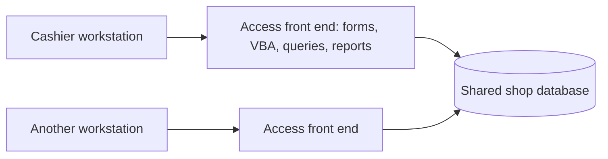

# Commercial POS: MS Access, SQL, and VBA

**In production since 2020 · Around 30 shops in Lebanon · Co-developed and sold with my father**

This is a commercial application that I continue to maintain. It supports daily retail work, including sales, reporting, and user management. This page describes the product and selected engineering concerns without distributing its source code or customer databases.

## My contribution

I worked with my father to develop and sell the application to businesses. My development work includes sales, reporting, and user-management functions in MS Access, SQL, and VBA. I am currently working on further improvements to the existing product while exploring a separate ERP/POS platform with another computer science student.

## Application structure

The application uses a split Microsoft Access architecture: a front end on each workstation contains forms, reports, queries, and VBA; a shared database stores shop data.

The system covers sales and payments, stock, customer accounts, and reporting. Working in Lebanon also involves amounts in US dollars and Lebanese pounds, along with Arabic and English interface/report text.

## Engineering example: cash-drawer reconciliation

A cash-drawer report must distinguish money physically present in the drawer from other forms of payment. A cheque contributes to recorded payments but must not increase the cash expected in the drawer.

For illustration, consider a synthetic single-currency example with no change or other cash movements:

| Item | Amount |
|---|---:|
| Opening cash float | 100 |
| Cash payments | 50 |
| Cheque payments | 40 |
| Expected physical cash | **150** |

Treating all payment receipts as drawer cash would produce 190. The intended drawer amount is 100 + 50 = 150, while cheque receipts remain visible separately.

Recent development work addresses this distinction, repeated opening floats across shifts, and consistent report rendering. The validation approach uses synthetic fixtures and independently calculated expected values, with regression checks for related flows. This example describes development work and its reasoning; it does not claim that every current change has been deployed to all shops.

## Maintaining an existing business application

The current development workflow uses copies of databases, text-based VBA/form sources, scripted builds, and targeted regression checks. AI-assisted tools support implementation and investigation. Business rules and expected financial results still need explicit decisions and independent checks.

The important constraints are preserving existing shop workflows and data, checking the effect of changes on related reports, and distinguishing a tested development build from a customer release.

## Separate ERP/POS exploration

Alongside the live Access product, I work with another computer science student on an early-stage ERP/POS concept. We investigate business workflows and POS hardware, evaluate existing ERP components, and identify the backend functionality we would need to implement. The intended stack emphasizes **Kotlin/Spring Boot, PostgreSQL, and Flutter**.

The [Inventory Playground](https://github.com/Amir-Merchad/inventory-playground) provides a public learning prototype for parts of that stack. It is not the live Access product or a completed replacement.

[Back to my profile](../README.md)
