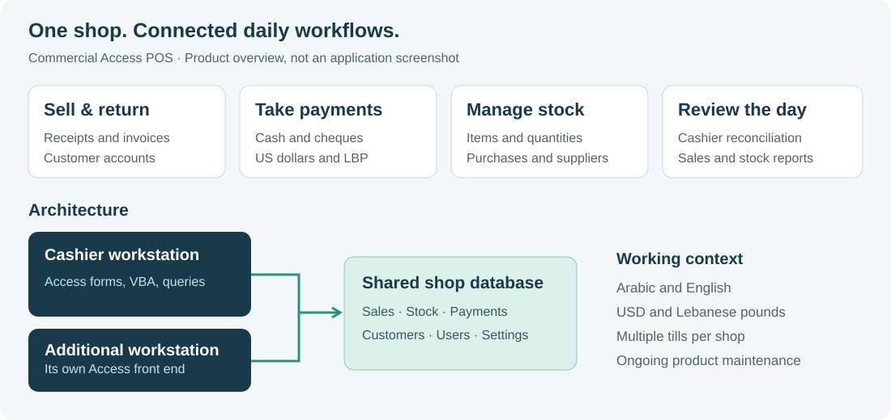

# Carto POS | Commercial retail software

**In production since 2020 · Around 30 shops in Lebanon · Co-developed and sold with my father**

This is a commercial application that I continue to maintain. It supports daily retail work, including sales, reporting, and user management. This page describes the product and selected engineering concerns without distributing its source code or customer databases.

## My contribution

I worked with my father to develop and sell the application to businesses. My development work includes sales, reporting, and user-management functions in MS Access, SQL, and VBA. I am currently working on further improvements to the existing product while exploring a separate ERP/POS platform with another computer science student.

## What is live, and what is in development?

| Work | Status |
|---|---|
| Commercial Access POS | Live since 2020; currently used by around 30 shops in Lebanon. |
| UI modernization and current maintenance changes | In development; this page does not claim rollout to every shop. |
| New ERP/POS platform with a fellow CS student | Early requirements work and component evaluation. |
| [Inventory Playground](https://github.com/Amir-Merchad/inventory-playground) | Implemented Kotlin/Spring Boot/PostgreSQL/Flutter learning prototype; not a replacement product. |

## Product showcase

| A shop needs to... | Application capability |
|---|---|
| Complete a sale and handle a return | Cash sales, customer invoices, receipts and return lines |
| Accept and reconcile payments | Cash and cheque handling, US dollars and Lebanese pounds, cashier shifts |
| Keep stock and purchasing records | Items, quantities, suppliers, purchases and stock reports |
| Follow up customer balances | Customer accounts, payments on account and statements |
| Review the business | Sales, profit, stock and other back-office reports |

These describe the product's scope; my specific contribution is outlined above. The visual is an explanatory diagram, not a screenshot of the application. The current UI modernization is in development, so it should not be confused with the version deployed at shops.

## Application structure

Each workstation runs an Access front end containing forms, reports, queries and VBA. Workstations connect to a shared shop database. This makes transaction boundaries, stock consistency and coordination between tills important engineering concerns.

For a reviewer, the useful engineering questions are concrete: can two tills affect the same invoice, does a return update the related stock correctly, and do reports distinguish payments from cash physically held? These are maintenance concerns for an existing business application, rather than claims about a new architecture.

## Engineering example: cash-drawer reconciliation

A cash-drawer report must distinguish money physically present in the drawer from other forms of payment. A cheque contributes to recorded payments but must not increase the cash expected in the drawer.

For illustration, consider a synthetic single-currency example with no change or other cash movements:

| Item | Amount |
|---|---:|
| Opening cash float | 100 |
| Cash payments | 50 |
| Cheque payments | 40 |
| Expected physical cash | **150** |

Treating all payment receipts as drawer cash would produce 190. The intended drawer amount is 100 + 50 = 150, while cheque receipts remain visible separately.

A meaningful check derives **150 from the fixture inputs before reading the report output**. A counted drawer of 150 should then reconcile to a difference of 0. This avoids using the implementation's own result as the expected answer.

Recent development work addresses this distinction, repeated opening floats across shifts, and consistent report rendering. The validation approach uses synthetic fixtures and independently calculated expected values, with regression checks for related flows. This example describes development work and its reasoning; it does not claim that every current change has been deployed to all shops.

## Maintaining an existing business application

The current development workflow uses copies of databases, text-based VBA/form sources, scripted builds, and targeted regression checks. AI-assisted tools support implementation and investigation. Business rules and expected financial results still need explicit decisions and independent checks.

The important constraints are preserving existing shop workflows and data, checking the effect of changes on related reports, and distinguishing a tested development build from a customer release.

## Separate ERP/POS exploration

Alongside the live Access product, I work with another computer science student on an early-stage ERP/POS concept. We investigate business workflows and POS hardware, evaluate existing ERP components, and identify the backend functionality we would need to implement. The intended stack emphasizes **Kotlin/Spring Boot, PostgreSQL, and Flutter**.

The [Inventory Playground](https://github.com/Amir-Merchad/inventory-playground) provides a public learning prototype for parts of that stack. It is not the live Access product or a completed replacement.

The prototype implements product CRUD, search, pagination and validation. Its source was inspected during this portfolio review; application tests were not run. The Access workspace review was also read-only, with no Access launch, database changes or build execution.

[Back to my profile](../README.md)
